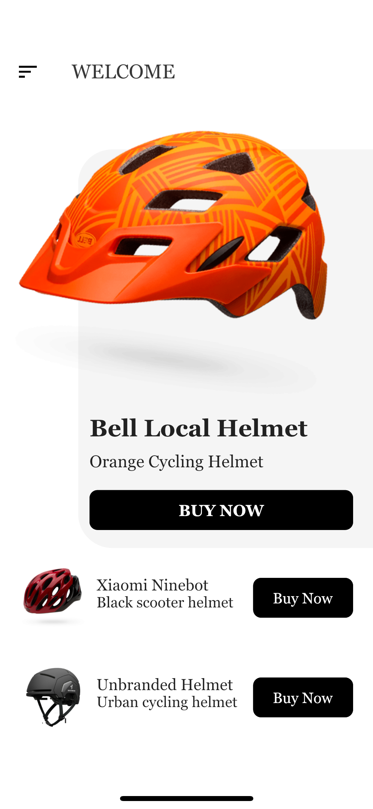
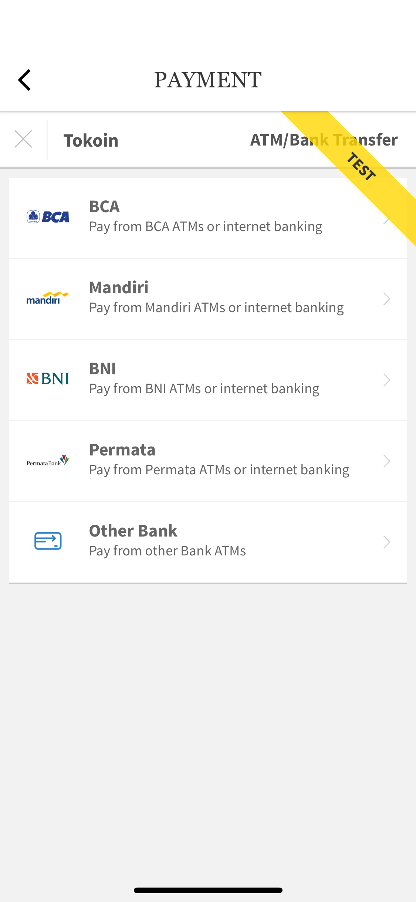
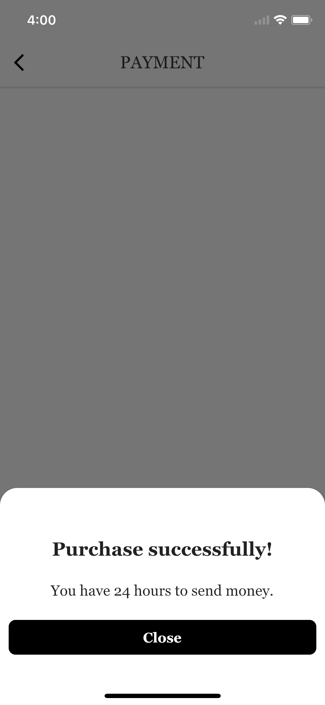

An example how to use [midtrans](https://midtrans.com/) as a payment gateway on both of mobile and backend.

### Show some :heart: and star the repo to support the project

### How to Run:

#### Backend:

- cd backend
- virtualenv .venv
- source .venv/bin/activate
- pip install -r requirements.txt
- cp app/settings-default.py app/settings.py
- replace `MIDTRANS_SERVER_KEY` and `MIDTRANS_CLIENT_KEY` with your current key in app/settings.py
- python3 wsgi.py

#### Mobile:

- cd flutter_midtrans
- replace `MIDTRANS_CLIENT_KEY` in lib/config/config.dart
- flutter run

### Screenshots

   

### Created & Maintained By

[Trong Dinh](https://github.com/trongdth) ([@trongdth](https://www.twitter.com/trongdth))

> If you found this project helpful or you learned something from the source code and want to thank me, consider buying me a cup of :coffee:
>
> * [Ethereum address: 0x9a1592C20A15f99AbB6b69E199f38D50Fa8372Ac]
> * [EOS account: zcryptoman1z]

## Getting Started

- For help getting started with Flutter, view [online documentation](https://flutter.dev/docs), which offers tutorials, 
samples, guidance on mobile development, and a full API reference.

- For help getting started with Python Flask, view [online documentation](https://github.com/pallets/flask), which offers tutorials, 
samples, and a full API reference.
